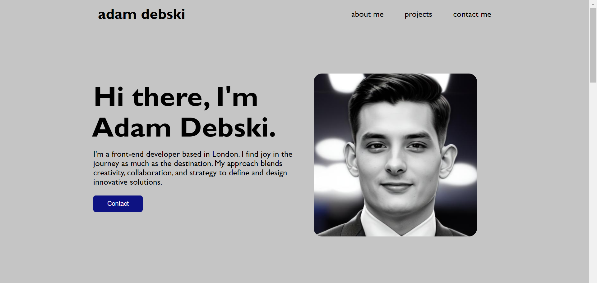

# Challenge-2

## Description

The aim of this project was to produce a responsive portfolio to test my recently acquired knowledge of html and css. While this is only my first attempt at building a webpage from scratch, I plan to build on this porfolio page in the future, enabling me to see the progress I'm making in my software development journey.

I built this page with some requirements in mind:

* When the page is loaded the page presents my name, a recent photo or avatar, and links to sections about me, my work, and how to contact me
* When one of the links in the navigation is clicked then the UI scrolls to the corresponding section
* When viewing the section about my work, the section contains titled images of my applications
* When presented with the first application, the application's image should be larger in size than the others
* When images of the applications are clicked then the user is taken to that deployed application
* When the page is resized or viewed on various screens and devices then the layout is responsive and adapts to my viewport

## Deployed application

[Link to deployed application](https://adam-deb.github.io/Challenge-2/)

## Screenshot

Here is a screenshot of the deployed portfolio:

## Installation

N/A

## Credits

N/A